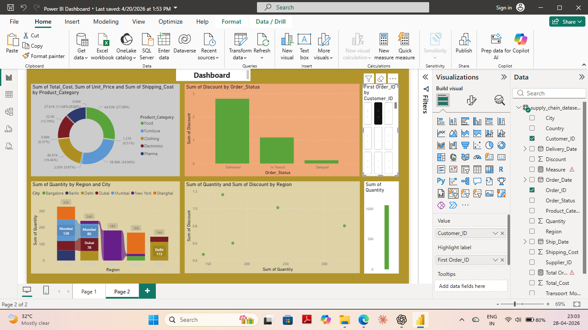

# 📊 Power BI Logistics Dashboard

## 📊 Overview
This project presents an interactive Power BI dashboard to analyze logistics and supply chain data.

## 🎯 Objectives
- Track shipment performance 🚚  
- Analyze delivery delays ⏱️  
- Generate operational insights 📊  

## 📊 Features
- KPI cards (Orders, Delays, Profit)  
- Region-wise performance analysis  
- Interactive filters  

## 🛠 Tools Used
- Power BI  
- Data Modeling  
- DAX  

## 🖼 Dashboard Preview

## 📂 Project File
🔽 [Download Dashboard](powerbi-logistics-dashboard.pbix)

## 👩‍💻 Author

Shambhavi Tripathi

https://www.linkedin.com/in/shambhavi-tripathi-94bb9937a

https://github.com/shambhavi04august-hub

Logistics Professional 🚚 | Tech Enthusiast 💻 | Data-Driven 📊
